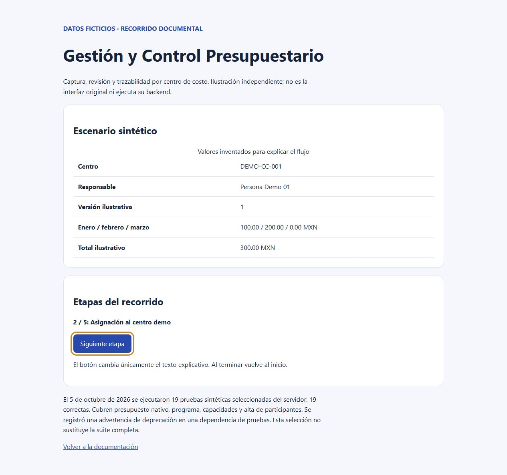

# Gestión y Control Presupuestario

Captura descentralizada, control de versiones y revisión de presupuestos por centro de costo.

> [!NOTE]
> **Repositorio documental.** El código operativo permanece privado. Aquí se publican documentación técnica, arquitectura, captura del recorrido y un ejemplo reproducible con datos sintéticos.

[Probar el ejemplo](#probar-el-ejemplo) · [Caso de estudio](docs/case-study.md) · [Arquitectura](docs/architecture.md) · [Verificación y límites](docs/verification.md)

## Problema

La integración de presupuestos financieros anuales suele depender de múltiples hojas de cálculo dispersas entre responsables de área. Esto genera dificultades para controlar qué versión está vigente, confusión entre borradores preliminares y cifras aprobadas, pérdida de comentarios de revisión y riesgo de sobrescribir montos durante la consolidación final.

## Solución

Una solución que descentraliza la captura y formaliza el ciclo presupuestario:
- **Asignación por centro:** cada propietario captura exclusivamente los centros de costo y rubros bajo su responsabilidad.
- **Ciclo de revisión estricto:** flujo formal de estados (*Borrador privado → Entrega → En revisión → Devuelto con observaciones → Validado*).
- **Control de concurrencia:** validación de la versión esperada en el servidor para evitar que dos revisiones concurrentes se sobrepongan.
- **Trazabilidad histórica:** resguardo inmutable de cada entrega previa para auditoría y comparativas entre versiones.



*Recorrido explicativo con datos sintéticos. Ilustración independiente; no ejecuta la aplicación operativa.*

## Aportación personal

Relevé y verifiqué las necesidades de captura y consolidación con los responsables de área para diseñar el ciclo de estados presupuestarios (*Borrador → Entrega → Revisión → Validación*). Estructuré las reglas de validación en el servidor y el mecanismo de control de versiones concurrentes para evitar sobreescrituras accidentales entre centros de costo.

## Probar el ejemplo

Requiere Python 3 y biblioteca estándar. Desde la raíz del repositorio:

```text
python examples/verify.py
```

Comprueba la consolidación de montos mensuales de un presupuesto sintético y la conservación de su versión y estado.

Para explorar el ciclo de revisión en el navegador, abra [demo/index.html](demo/index.html) de forma local.

## Resultados comprobados

- **Trazabilidad de versiones y estados:** conservación estructurada de borradores, entregas y observaciones por centro de costo.
- **Control de concurrencia:** verificación de la versión esperada en el backend antes de persistir cambios.
- **Suite de pruebas de servidor:** 19 pruebas sintéticas seleccionadas del servidor ejecutadas correctamente (5 de octubre de 2026), cubriendo presupuesto nativo, asignaciones, capacidades y alta de participantes.

No se publican métricas no medidas de ahorro en tiempos contables ni capacidad del sistema.

## Tecnologías

| Alcance | Tecnologías |
|---|---|
| Observadas en la fuente | React, TypeScript, Python, FastAPI, SQLAlchemy, SQLite, Alembic |
| Ejemplo público | Python 3 (biblioteca estándar), HTML/CSS estático |

## Límites

- El código operativo completo es privado y no se distribuye en este repositorio.
- Las 19 pruebas ejecutadas corresponden a una selección sintética del backend que no sustituye la suite completa de integración ni la aprobación funcional de Finanzas.
- Validación de catálogos contables avanzados y acceso móvil quedan pendientes de etapas posteriores.

Detalle técnico y condiciones pendientes: [verificación y límites](docs/verification.md).

## Licencia

Pendiente de decisión expresa. No se asigna licencia ni derechos sobre el código privado.
