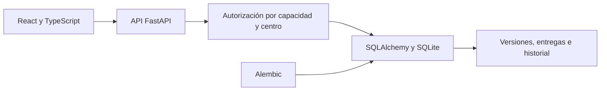

# Arquitectura revisada

Fecha: 2026-10-05. Diagrama del alcance observado, con nombres de componentes genéricos.

## Componentes y responsabilidades

- Plantillas versionadas y asignaciones por propietario y centro.
- Borrador privado, entrega, revisión, devolución y validación.
- Control de concurrencia mediante la versión esperada.
- Conservación de entregas, cambios y referencias históricas.
- Capacidades de lectura global y captura comprobadas por el servidor.

## Arquitectura del repositorio público

Este repositorio contiene Markdown, un JSON sintético, un verificador Python de biblioteca estándar y un recorrido HTML autónomo. No contiene backend, servicios externos ni réplica del sistema operativo. El diagrama anterior describe la fuente local revisada.

## Límites

- Aceptación funcional con responsables de Finanzas.
- Comprobación de la entrega y entorno operativo vigente antes de una intervención.
- Validación de reglas, catálogos y condiciones de operación aplicables a cada versión.
- Recuperación, acceso desde dispositivos y licencia en su fase propia.
