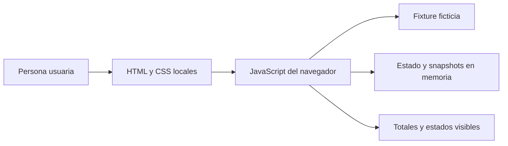
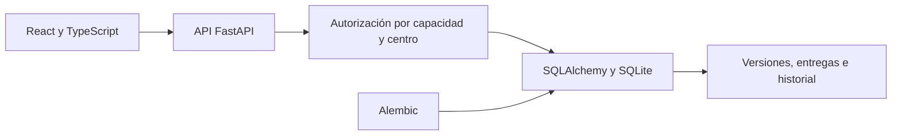

# Arquitectura y límites

## Demo pública reproducible

La demo se compone de HTML, CSS, el módulo de estado `demo/budget-state.js` y la interfaz `demo/app.js`, con una fixture sintética incrustada en `demo/index.html`. `examples/scenario.json` replica esa fixture; los verificadores Python y Node comprueban los datos y las transiciones del módulo compartido.

- Cálculos y cambios de estado ocurren dentro de la página.
- Los perfiles, centros y asignaciones son ficticios. El filtro de asignación se ejecuta en el navegador y puede modificarse; no autoriza acceso.
- No hay API, base de datos, login, almacenamiento local ni persistencia tras cerrar o reiniciar la página.
- Cada entrega agrega un snapshot independiente en memoria. Una devolución permite crear otra entrega y mantiene disponible la anterior durante esa sesión.

## Fuente original revisada

El siguiente diagrama describe componentes observados en la fuente local el 5 de octubre de 2026; no describe ni se ejecuta desde la demo pública.

La fuente revisada incluye plantillas versionadas, borradores, entregas, revisión, devolución, control de versiones y capacidades verificadas por el servidor. Esta descripción no demuestra el estado operativo actual ni acredita aceptación funcional.

## Límites

- Aceptación funcional con responsables de Finanzas.
- Comprobación de la entrega y entorno operativo vigentes antes de cualquier intervención.
- Validación de reglas, catálogos y condiciones aplicables a cada versión.
- Persistencia, recuperación, concurrencia real, acceso desde dispositivos y licencia.
