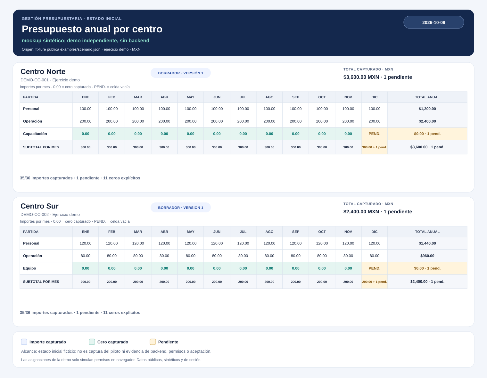

# Caso de estudio: Gestión y Control Presupuestario

## Necesidad

Organizar captura y revisión presupuestaria por centro, conservar versiones y distinguir borradores, entregas y decisiones de revisión.

## Aportación documentada

Relevé necesidades de captura y consolidación para estructurar el ciclo de borrador, entrega, revisión, devolución y validación. Definí reglas de validación en servidor y control de versiones para evitar sobreescrituras accidentales. La descripción se refiere a la fuente original revisada; este repositorio no contiene su código operativo.

## Evidencia pública reproducible

La [demo local](../demo/index.html) contiene datos inventados para dos centros, tres partidas y doce meses. Permite editar montos, ver totales, distinguir cero de pendiente, entregar, devolver con observación, volver a entregar, validar y revisar snapshots e intentos obsoletos. Las asignaciones solo simulan permisos en navegador. Los datos y el historial existen únicamente en memoria.

Este SVG estático se genera con `node examples/render_mockup.js` desde la fixture pública. Lleva fecha, origen y alcance; no representa ni ejecuta la interfaz operativa.

Ejecuta `python examples/verify.py` desde la raíz del repositorio para comprobar la fixture usada tanto por la demo como por el ejemplo JSON. Esta verificación no ejercita el backend original.

## Decisiones y límites

Un cero se registra como importe; una celda vacía queda pendiente. La demo exige completar importes antes de entregar. Cada envío válido agrega una copia al historial, y una devolución no borra esa copia. Una solicitud con versión esperada antigua se rechaza antes de cambiar montos o snapshots.

El control de versiones mostrado es una simulación local. No prueba concurrencia real, permisos del servidor, persistencia, auditoría operativa ni aceptación de usuarios.

## Evidencia histórica de la fuente original

El 5 de octubre de 2026 se ejecutaron 19 pruebas sintéticas seleccionadas del servidor local privado: 19 correctas. La selección cubrió presupuesto nativo, programa, capacidades y alta de participantes. Es evidencia histórica acotada; las pruebas no se publican ni se pueden reproducir desde esta demo.

## Pendiente

- Aceptación funcional por responsables de Finanzas.
- Verificación del entorno y la versión actuales antes de intervenciones operativas.
- Validación de reglas y catálogos aplicables a cada versión.
- Persistencia y recuperación verificadas, concurrencia real, acceso móvil y licencia.
